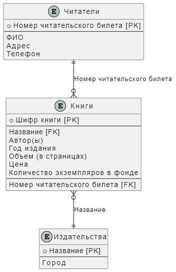
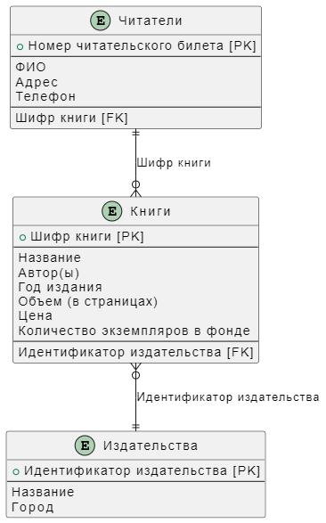

# Логическая структура БД для создания "Библиотеки"

## Таблица "Читатели"

- Номер читательского билета (первичный ключ)
- ФИО
- Адрес
- Телефон

## Таблица "Книги"

- Шифр книги (первичный ключ)
- Название (внешний ключ)
- Автор(ы)
- Год издания
- Объем (в страницах)
- Цена
- Количество экземпляров в фонде
- Номер читательского билета (внешний ключ)

## Таблица "Издательства"

- Название (первичный ключ)
- Город

## Связи между таблицами

### Первичные ключи

- "Номер читательского билета" в таблице "Читатели"
- "Шифр книги" в таблице "Книги"
- "Название" в таблице "Издательства"

### Внешние ключи

- "Номер читательского билета" в таблице "Книги" (связь с таблицей "Читатели")
- "Название" в таблице "Книги" (связь с таблицей "Издательства")

## Связь между таблицами "Читатели" и "Книги"

Поле "Номер читательского билета" из таблицы "Читатели" является внешним ключом в таблице "Книги", связывающим информацию о читателях с книгами, которые они забрали. Эта связь позволяет отслеживать, какие книги имеются у каждого читателя.

## Связь между таблицами "Книги" и "Издательства"

Поле "Название" из таблицы "Издательства" является внешним ключом в таблице "Книги", связывающим информацию о издательствах с конкретными книгами.

Правильно работает, если название книги уникальное (не повторяется), если назнавние книг не уникальное, для связи нужно ввести новое поля в таблицу "Книги" и "Издательства".

### Таблица "Издательства" с новым ключом

- Идентификатор издательства (первичный ключ)
- Название (уже не является первичным ключом)
- ...

### Таблица "Книги" с новым ключом

- ...
- Название (уже не является внешнем ключом к таблице "Издательства")
- ...
- Идентификатор издательства (внешний ключ)

Такая структура позволит хранить информацию о читателях, книгах и издательствах, а также устанавливать связи между этими сущностями для более эффективного управления библиотекой.

## Схема структуры БД для создания "Библиотеки"

## Схема структуры БД для создания "Библиотеки" с новым ключом

