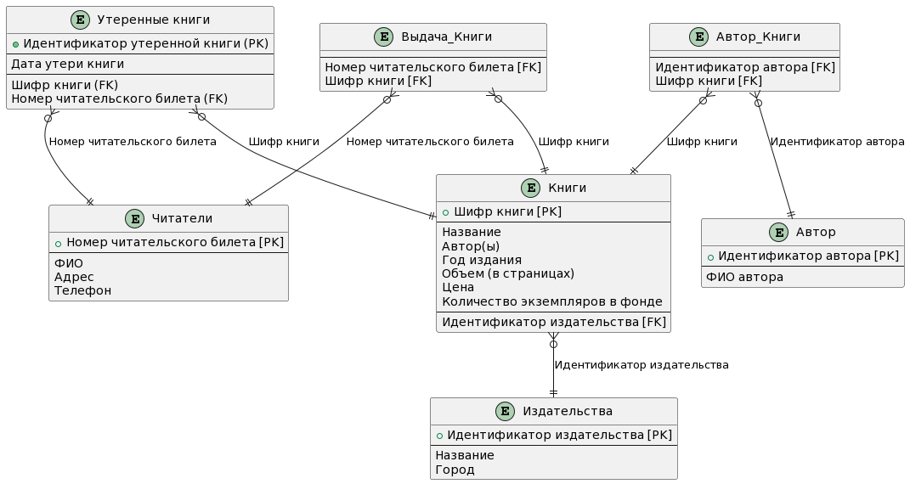

# Логическая структура БД для создания "Библиотеки"

## Таблица "Читатели"

- Номер читательского билета (первичный ключ)
- ФИО
- Адрес
- Телефон

## Таблица "Книги"

- Шифр книги (первичный ключ)
- Название
- Автор(ы)
- Год издания
- Объем (в страницах)
- Цена
- Количество экземпляров в фонде
- Идентификатор издательства (внешний ключ)

## Таблица "Издательства"

- Идентификатор издательства (первичный ключ)
- Название
- Город

## Таблица "Автор"

- Идентификатор автора (первичный ключ)
- ФИО автора

## Таблица "Выдача_книги"

- Номер читательского билета (внешний ключ)
- Шифр книги (внешний ключ)

## Таблица "Автор_киги"

- Идентификатор автора (внешний ключ)
- Шифр книги (внешний ключ)

# Связи между таблицами

### Первичные ключи

- "Номер читательского билета" в таблице "Читатели"
- "Шифр книги" в таблице "Книги"
- "Идентификатор издательства" в таблице "Издательства"
- "Идентификатор автора" в таблице "Автор"

### Внешние ключи

- "Идентификатор издательства" в таблице "Книги" (связь с таблицей "Издательства")
- "Идентификатор автора" в таблице "Автор_Книги" (связь с таблицей "Автор")
- "Шифр книги" в таблице "Автор_Книги" (связь с таблицей "Книги")
- "Шифр книги" в таблице "Выдача_Книги" (связь с таблицей "Книги")
- "Номер читательского билета" в таблице "Выдача_Книги" (связь с таблицей "Читатели")

## Связь между таблицами "Читатели" и "Книги"

Поле "Шифр книги" из таблицы "Книги" является внешним ключом в таблице "Выдача_Книги", связывающим информацию о читателях с книгами при помощи поля "Номер читательского билета" из таблицы "Читатели". Эта связь позволяет отслеживать, какие книги имеются у каждого читателя.

## Связь между таблицами "Книги" и "Издательства"

Поле "Идентификатор издательства" из таблицы "Издательства" является внешним ключом в таблице "Книги", связывающим информацию о издательствах с конкретными книгами.

## Связь между таблицами "Книги" и "Автор"

Поле "Шифр книги" из таблицы "Книги" является внешним ключом в таблице "Автор_Книги", связывающим информацию о авторах с книгами при помощи поля "Идентификатор автора" из таблицы "Автор". Эта связь позволяет отслеживать, кто является автором книги, какие книги написал автор.

## Схема структуры БД для создания "Библиотеки"



# Запуск PostgreSQL

## Создание контейнера

Скачайте репозиторий, и выполните команду в командной строке для скачивания образа PostgreSQL и создания контейнера.

```bash
docker-compose up -d
```

После установки, контейнер с базой запустится автоматически, также создадутся таблицы "Библиотеки". Для подключения к базе и вывода таблиц используйте следующие команды.

- подключение к базе

```bash
docker exec -it library_postgres psql -U postgres -d library
```

- вывод созданных таблиц

```psql
\dt
```
